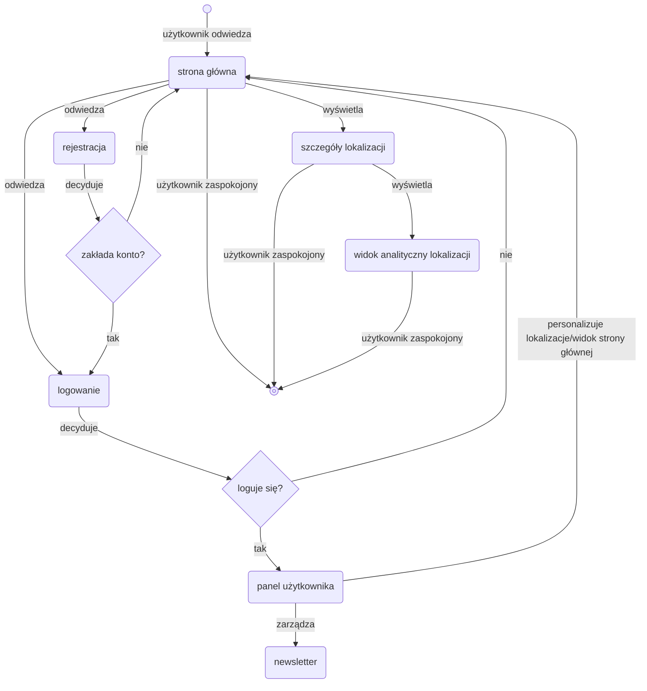

## 1. Analiza wymagań

### Funkcjonalne:
- **Możliwość sprawdzenia ogólnej jakości powietrza**
- **Wyświetlanie spersonalizowanych danych o jakości powietrza**
- **Możliwość założenia konta i dodania ulubionych lokalizacji**
- **Wyświetlanie ostrzeżeń o jakości powietrza**
- **Wysyłanie powiadomień o jakości powietrza w lokalizacjach użytkownika**
- **Możliwość modyfikacji danych konta**

### Niefunkcjonalne:
- **Dostępność 24/7**
- **Czas odpowiedzi ≤ 5 sekundy**
- **Zgodność z RODO**
- **Szyfrowanie danych in-transit i at rest**

## 2. Identyfikacja interesariuszy

### Użytkownik niezarejestrowany:
- **Monitorowanie jakości powietrza**
- **Wyświetlanie analityki jakości powietrza dla wybranej lokalizacji**

### Użytkownik zarejestrowany:
- **Monitorowanie jakości powietrza**
- **Dodawanie ulubionej lokalizacji**
- **Wyświetlanie analityki jakości powietrza dla spersonalizowanych lokalizacji**
- **Otrzymywanie spersonalizowanych powiadomień o jakości powietrza**

### Administrator IT:
- **Bezpieczeństwo danych**
- **Kopie zapasowe**

### Administrator aplikacji:
- **Zarządzanie użytkownikami**
- **Zarządzanie danymi**

## 3. Lista wymagań funkcjonalnych

**ID** | **Opis wymagania** | **Priorytet** | **Źródło**
---|----------------------------------------------|----------|------------------------------
F1 | Użytkownik niezarejestrowany może założyć konto | Could | Użytkownik niezarejestrowany
F2 | Użytkownik zarejestrowany musi mieć możliwość zmiany hasła | Must | Użytkownik zarejestrowany
F3 | Użytkownik zarejestrowany może wybrać ulubione lokalizacje | Could | Użytkownik zarejestrowany
F4 | Użytkownik ma możliwość monitorowania jakości powietrza | Must | Użytkownik niezarejestrowany i zarejestrowany
F5 | Administrator aplikacji może usuwać użytkowników | Must | Administrator aplikacji
F6 | Administrator aplikacji pobiera dane przez API | Should | Administrator aplikacji

## 4. User Stories 

### 1. Użytkownik niezalogowany
- **Jako użytkownik niezalogowany chcę przeglądać mapę jakości powietrza, aby szybko sprawdzić aktualne warunki w mojej okolicy.**
- **Jako użytkownik niezalogowany chcę móc wyszukiwać lokalizacje na mapie, aby sprawdzić stan powietrza również w innych miejscach.**
- **Jako użytkownik niezalogowany chcę widzieć podstawowe dane o jakości powietrza po kliknięciu punktu na mapie, aby poznać najważniejsze informacje bez zakładania konta.**
- **Jako użytkownik niezalogowany chcę mieć dostęp do przejrzystych analiz i statystyk dotyczących jakości powietrza.**
- **Jako użytkownik niezalogowany chcę otrzymywać sugestie dotyczące aktywności fizycznej na dworze.**

### 2. Użytkownik zalogowany
- **Jako użytkownik zalogowany chcę monitorować jakość powietrza w wybranych lokalizacjach, aby mieć szybki dostęp do danych, które mnie interesują.**
- **Jako użytkownik zalogowany chcę ustawić ulubioną lokalizację, aby automatycznie otrzymywać aktualizacje jakości powietrza.**
- **Jako użytkownik zalogowany chcę otrzymywać spersonalizowane powiadomienia o pogorszeniu jakości powietrza, aby móc zareagować.**
- **Jako użytkownik zalogowany chcę zarządzać listą lokalizacji, dla których chcę otrzymywać powiadomienia, aby dostosować je do swoich potrzeb.**
- **Jako użytkownik zalogowany chcę przeglądać historię jakości powietrza dla moich lokalizacji, aby móc obserwować zmiany w czasie.**
- **Jako użytkownik zalogowany chcę otrzymywać sugestie dotyczące aktywności fizycznej na dworze.**

### 3. Administrator aplikacji
- **Jako administrator aplikacji chcę zarządzać kontami użytkowników, aby utrzymywać porządek i kontrolę nad systemem.**
- **Jako administrator aplikacji chcę móc blokować, usuwać i modyfikować konta użytkowników, aby reagować na nadużycia lub zgłoszenia.**
- **Jako administrator aplikacji chcę zarządzać danymi dotyczącymi lokalizacji oraz źródłami danych o jakości powietrza, aby system działał wiarygodnie i poprawnie.**
- **Jako administrator aplikacji chcę móc przeglądać statystyki systemu, aby monitorować jego obciążenie i liczbę aktywnych użytkowników.**

### 4. Administrator IT
- **Jako administrator IT chcę dbać o bezpieczeństwo danych użytkowników, aby chronić system przed naruszeniami i utratą danych.**
- **Jako administrator IT chcę wykonywać regularne kopie zapasowe, aby zapewnić możliwość odtworzenia systemu po awarii.**
- **Jako administrator IT chcę monitorować infrastrukturę serwerową, aby system działał stabilnie.**
- **Jako administrator IT chcę aktualizować komponenty techniczne aplikacji, aby utrzymać ją w zgodzie z najlepszymi praktykami bezpieczeństwa.**

## 5. Use Case Diagram

## 6. Opis wymagań niefunkcjonalnych

- **Dostępność 24/7**  
  System powinien być dostępny dla użytkowników przez całą dobę, siedem dni w tygodniu, z minimalnymi przerwami serwisowymi. Oznacza to, że użytkownicy mogą korzystać z aplikacji w dowolnym momencie, bez zauważalnych przerw w działaniu.

- **Czas odpowiedzi ≤ 5 sekundy**  
  Aplikacja powinna reagować na działania użytkownika w czasie krótszym niż 2 sekundy w 95% przypadków. Dotyczy to ładowania danych, wyświetlania mapy oraz generowania podstawowych analiz, co wpływa na komfort korzystania i płynność interakcji.

- **Zgodność z RODO**  
  System musi spełniać wymogi Rozporządzenia o Ochronie Danych Osobowych (RODO), w tym: minimalizację danych, możliwość usunięcia konta, informowanie o sposobach przetwarzania danych, zabezpieczenie danych osobowych oraz przetwarzanie ich wyłącznie w określonych celach.

- **Szyfrowanie danych in-transit i at rest**  
  Dane powinny być szyfrowane zarówno podczas przesyłania (in-transit), jak i podczas przechowywania (at rest). Zapewnia to ochronę danych użytkowników przed nieautoryzowanym dostępem oraz zwiększa bezpieczeństwo całej infrastruktury.
